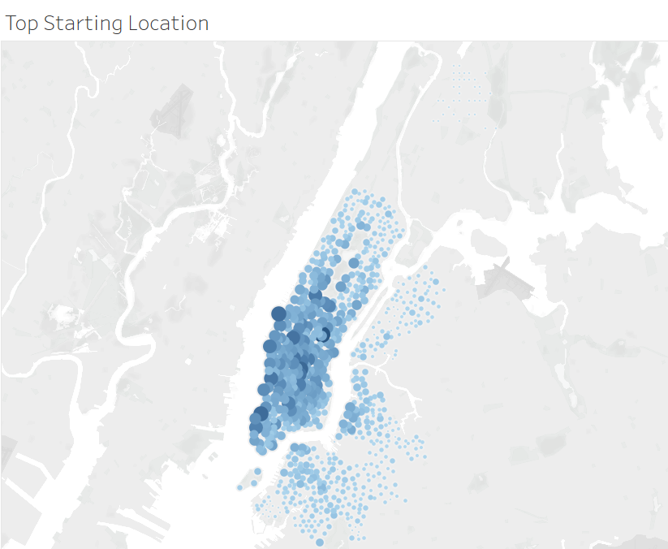
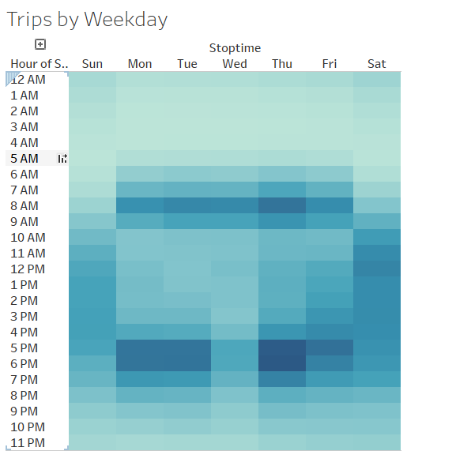
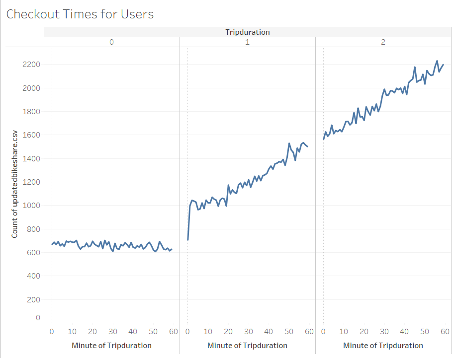
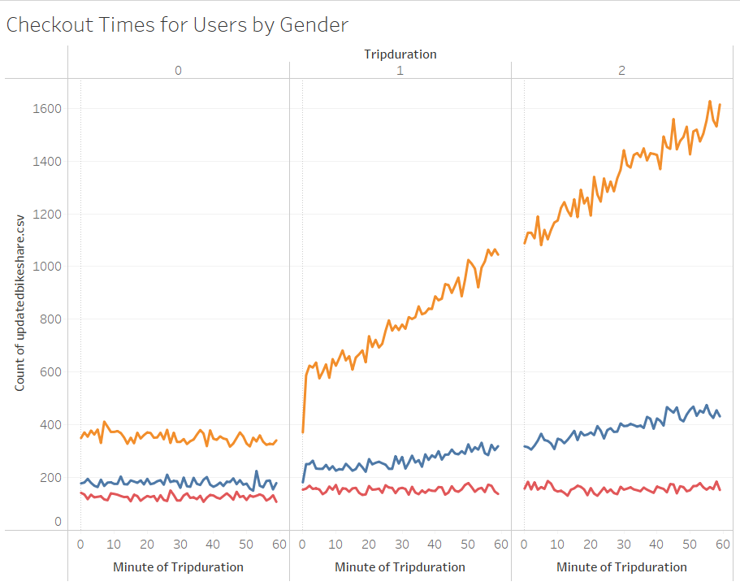
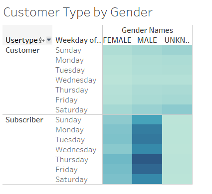

# citibikesharing
Creating visualizations using Tableau in order to analyze New York bike sharing data.

## Project Overview 

The purpose of this project is to analyze New York City's Citibike usage for results that might be useful for analyzing the viability of opening a bike-share system in Des Moines, Iowa. 

# Design Solution

- Import data into Tableau;
- Create and style worksheets, dashboards, and stories using Tableau;
- Use Tableau worksheets to display data;
- Portray data accurately using Tableau dashboards.

## Results 

[Tableau Book with charts, dashboards, and story can be found here:]
https://public.tableau.com/app/profile/blair.webb/viz/CitiBikesharing/Story1

## Overall Summary of Trips and Customers

### Popular Riding Locations and Times

The concentration of starting and ending locations indicate an office-centric usage. High traffic zones that seem to generate bike-rental rather than a taxi or rideshare service during the peak hours of rush hour traffic would be of more benefit to office workers needing further transportation after leaving the metro. 

### Checkout Time Summary

The length of time seems to remain fairly static compared by gender and as a whole.

### Customer Type

Most of the subscribers are male, and the majority of rides by subscribers are taken on weekdays with Thursday being the busiest rental day. One-time customers seem to prefer the weekend and are slightly more likely to be uninterested in disclosing their gender. Men also appear to be more comfortable in renting bikes during off-commute hours and after-dark than females or those of undisclosed gender.

## Summary

The bikes are used mostly for short trips and during commute times around the same area of Manhattan, where most customers are male subscribers.

### Additional Visualization Suggestions

- In order to help to analyze the viability of opening a bike-share system in Des Moines, Iowa, additional data should be collected and extra charts should be plotted:
    - Collect data around different seasons to accurately predict winter impact.
        - Plot peak hours, weekdays, and popular start and end stations for the other seasons.
    - Collect data regarding repair costs vs incoming profits to determine viability during off-season.
        - Plot a bike usage graph, seasonal usage, typical repair costs, severe weather repair costs, and whether annual subscription can maintain offseason usage.

